# NotificationApp
App simples para criar uma notificação + recebimento de messagem remota com firebase

Links:

Criando notificação simples:
https://developer.android.com/training/notify-user/build-notification#SimpleNotification

Anatomia de notificação:
https://developer.android.com/guide/topics/ui/notifiers/notifications#Templates

Firebase:
https://console.firebase.google.com/

Tutorial Em Video:
https://youtu.be/D99CVOKSgJQ

Tutorial em PDF:
https://github.com/angeloplacebo/notificationApp/blob/main/Projeto_PDM.2020.1%20-%20Android_Notifications.pdf

Source Code:
https://github.com/angeloplacebo/notificationApp/tree/main/NotificationApp


# Passo 1 = Enunciado

A premissa do nosso app é ter inicialmente apenas um botão que executa uma função que gera uma notificação para o usuário. Após entender o funcionamento deste passo iremos integrá-lo com o Firebase para que recebamos notificações de forma remota. Sabendo que por padrão com o aplicativo aberto as notificações enviadas pelo [FCM](https://firebase.google.com/docs/cloud-messaging?hl=pt-br "Firebase Cloud Messaging") não são exibidas, iremos definir um serviço para que a mesma seja criada e exibida mesmo com o app aberto.

# Passo 2 = Definição
Vamos dividir a construção do nosso aplicativo em duas partes. Na primeira criaremos uma função para que uma notificação seja gerada e exibida ao clique de um botão. Na segunda vamos conectar o app com o firebase e adicionar o [FCM](https://firebase.google.com/docs/cloud-messaging?hl=pt-br "Firebase Cloud Messaging"), em seguida criaremos o serviço do firebase para que a notificação seja criada quando o app estiver em primeiro plano.

# Passo 3 = Parte 1

Inicialmente criamos nosso aplicativo no Android Studio.

```
	Name: NotificationApp
	Package name: com.angeloplacebo.notificationapp
	Language: Kotlin
	Minimum SDK: API 16 Android 4.1 (Jelly Bean)
```
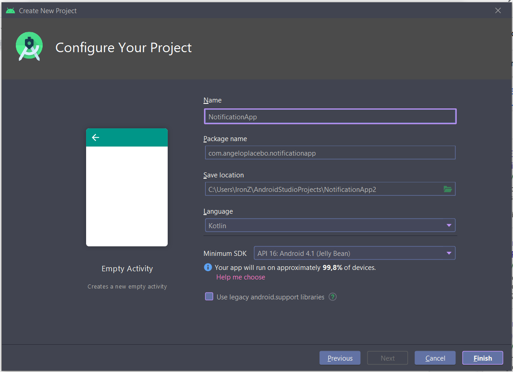

Vamos alterar o layout para LinearLayout, definir orientação vertical e gravity como center e criar um botão com id btNotificar conforme a figura 2.

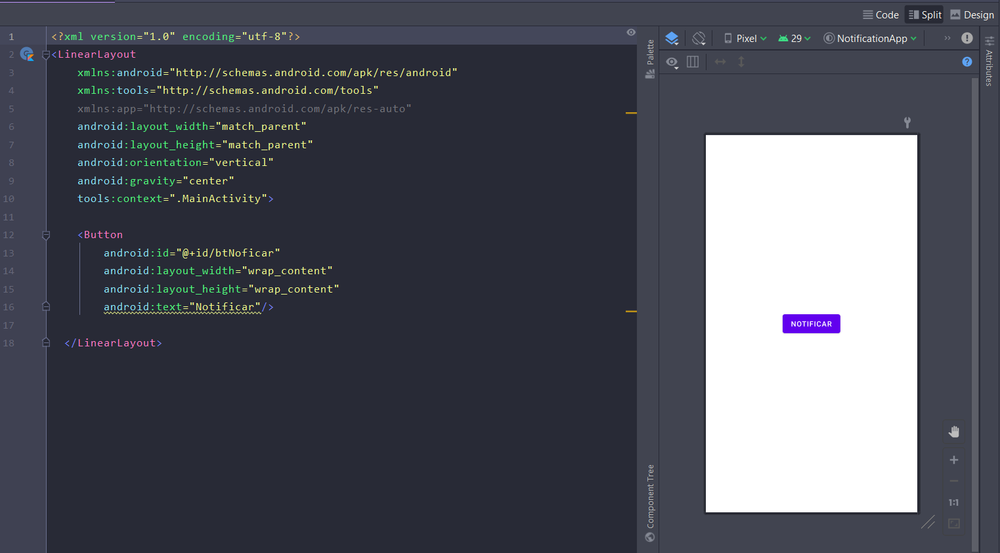

Em seguida iremos criar uma variável lateinit para este botão e resgatá lo utilizando o método findViewByID conforme o codigo abaixo.

<!-- 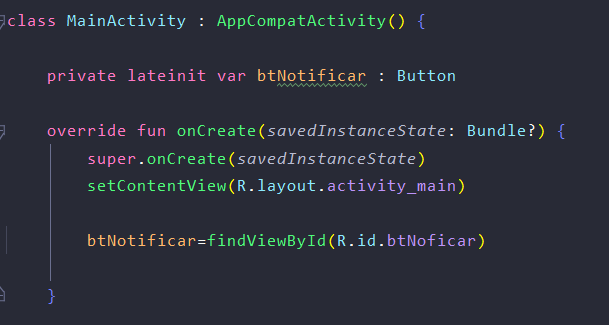 -->

```kotlin
class MainActivity : AppCompatActivity() {

    private lateinit var btNotificar : Button

    override fun onCreate(savedInstanceState: Bundle?) {
        super.onCreate(savedInstanceState)
        setContentView(R.layout.activity_main)

        btNotificar=findViewById(R.id.btNoficar)

    }
```

Em seguida vamos criar a notificação através de uma função que chamaremos de _criarNotificacao_, nela definiremos primeiramente as variáveis título, descrição e corpo.

Para que o título fique negrito usaremos a classe _htmlCompat_.

Precisamos criar o canal de notificação que por sua vez necessita de um id que terá o nome do nosso pacote, definiremos também nosso builder que é um objeto NotificationCompat.Builder. de mesmo modo um gerenciador de notificações é necessário, nele passamos o serviço de notificações do sistema por parâmetro, além disso uma notificação precisa de uma pendingIntent para ser iniciada no evento de clique dela, bem como uma id única para cada notificação gerada, sendo assim um número aleatório entre 1 e 100 será gerado através da função nextInt da classe Random.

<!-- 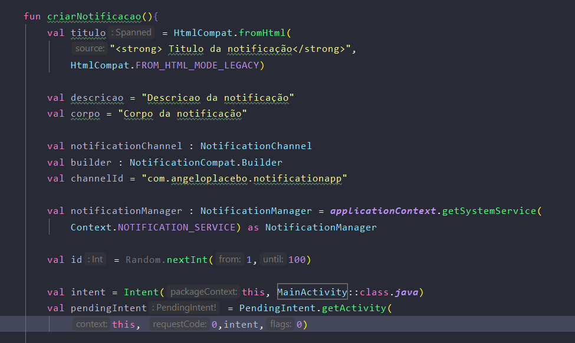 -->

```kotlin
fun criarNotificacao(){
        val titulo = HtmlCompat.fromHtml(
            "<strong> Titulo da notificação</strong>",
            HtmlCompat.FROM_HTML_MODE_LEGACY)

        val descricao = "Descricao da notificação"
        
        val corpo = "Corpo da notificação"

        val notificationChannel : NotificationChannel
        val builder : NotificationCompat.Builder
        val channelId = "com.angeloplacebo.notificationapp"

        val notificationManager : NotificationManager = applicationContext.getSystemService(
            Context.NOTIFICATION_SERVICE) as NotificationManager

        val id = Random.nextInt(1,100)

        val intent = Intent(this, MainActivity::class.java)
        val pendingIntent = PendingIntent.getActivity(
            this, 0,intent,0)
```

Antes de uma notificação ser entregue é preciso registrar o canal de notificação sendo assim o trecho a seguir é bloqueado pela condição do SDK_INT pois este canal deverá ser criado apenas se estivermos utilizando a API de level 26 ou superior devido a esta classe ser nova, versões anteriores não a suportam.

>versões anteriores ignoram o channelId do método Builder da classe NotificationCompat.

Para criar o canal, alguns parâmetros são exigidos no construtor do NotificationChanel passaremos channelId, descrição e a importância através de NotificationManager.IMPORTANCE_DEFAULT) em seguidas passamos este objeto para o gerenciador de notificações no método createNotificationChannel.

<!-- 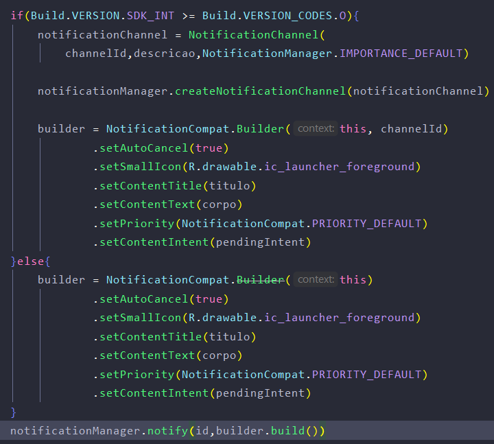 -->

Utilizando nosso objeto Builder da classe NotificationCompat.Builder vamos definir o conteúdo da nossa notificação. No código abaixo encontraremos os seguintes métodos:

* setAutoCancel = usado para fechar a notificação no evento de clique.

* setSmallIcon = define o ícone pequeno que é mostrado no cabeçalho da notificação.

* setContentTitle = define o título da notificação.

* setContentText = define o conteúdo(corpo) da notificação.

* setPriority = A prioridade determina se a notificação será intrusiva ou não no Android 7.1 e versões anteriores.

* setContentIntent = define a activity que será executada no evento de clique.

seguidamente iremos exibir a notificação, para isso chamaremos nosso objeto NotificationManager.notify, passando o id que geramos e o resultado de builder.build().

```kotlin
 if(Build.VERSION.SDK_INT >= Build.VERSION_CODES.O){
            notificationChannel = NotificationChannel(
                channelId,descricao,NotificationManager.IMPORTANCE_DEFAULT)

            notificationManager.createNotificationChannel(notificationChannel)

            builder = NotificationCompat.Builder(this, channelId)
                    .setAutoCancel(true)
                    .setSmallIcon(R.drawable.ic_launcher_foreground)
                    .setContentTitle(titulo)
                    .setContentText(corpo)
                    .setPriority(NotificationCompat.PRIORITY_DEFAULT)
                    .setContentIntent(pendingIntent)
        }else{
            builder = NotificationCompat.Builder(this)
                    .setAutoCancel(true)
                    .setSmallIcon(R.drawable.ic_launcher_foreground)
                    .setContentTitle(titulo)
                    .setContentText(corpo)
                    .setPriority(NotificationCompat.PRIORITY_DEFAULT)
                    .setContentIntent(pendingIntent)
        }
        notificationManager.notify(id,builder.build())
```

Desta forma temos o resultado mostrado na figura abaixo (Figura 3).

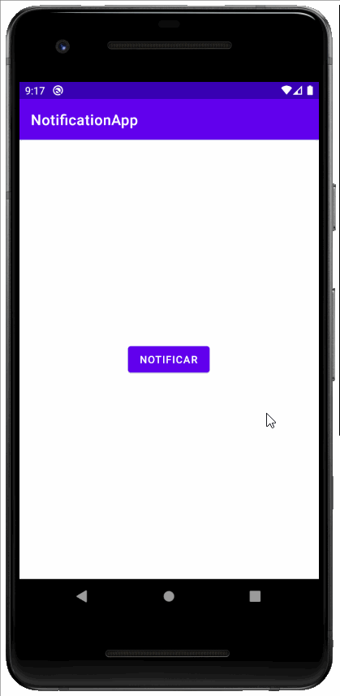

# Passo 4 = Parte 2

Neste passo vamos integrar nosso app com o serviço do firebase para que possamos receber notificações de forma remota utilizando o FCM.

Primeiramente autorize o uso de internet no arquivo de manifesto do seu aplicativo.para isso insira antes da abertura da tag application a seguinte linha de código:

```kotlin 
<uses-permission android:name="android.permission.INTERNET"/>
```

Agora acesse e faça login no console do [firebase](https://console.firebase.google.com/) no seu navegador padrão, e crie um projeto. Com ele criado podemos adicionar um app a ele que pode ser Ios, Android, Web ou Unity. No nosso caso a opção Android, logo podemos inserir os dados do nosso app como nome do pacote, e um apelido e a partir disso fazer o download do arquivo de configurações, entretanto existe uma maneira mais simples que é utilizando o Firebase Assistente, para isso basta acessar o menu ferramentas em seguida selecionar Firebase, Com ele aberto diversas opções serão mostradas, selecionaremos Cloud Messaging.

Neste momento temos o passo a passo automatizado para configurar nosso aplicativo, basta clicar em conectar ao firebase, uma nova janela será aberta em seu navegador, nela selecione o projeto recém criado, e automaticamente a conexão entre o app e o firebase será estabelecida.

De volta ao Android Studio no Assistente do firebase vamos clicar em adicionar fcm ao seu app para que todas as dependências sejam instaladas, aceite as mudanças que ele mostrará e aguarde o processo de sincronização finalizar. presentemente podemos enviar uma notificação remota, na página do projeto navegue até a opção Cloud Messaging e selecione enviar sua primeira mensagem, deste modo temos cinco passos sendo 2 desses opcionais. Em notificação preenchemos as informações da mensagem que será enviada. No menu Segmentação selecione seu aplicativo, o menu programação refere se a quando a notificação será enviada. Após a publicação a notificação deverá ser exibida instantaneamente. Lembrando que o aplicativo deve estar em background ou fechado para que a notificação seja entregue uma vez que por padrão a notificação só é exibida nestas condições.(Telas de construção da notificação abaixo).

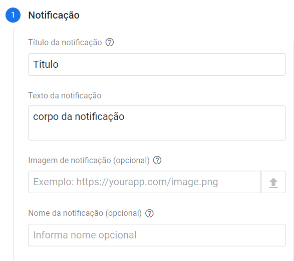
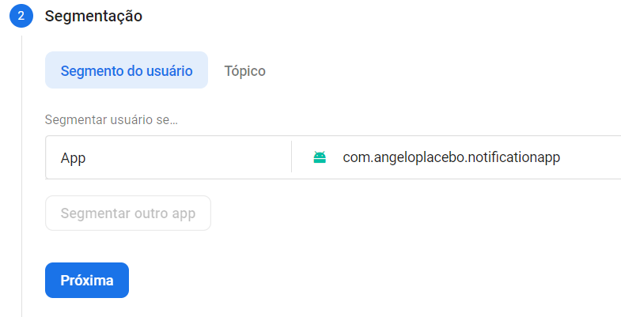
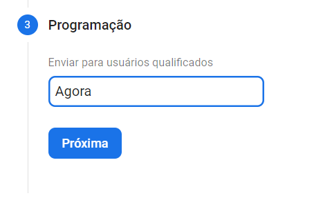

>Notificação entregue

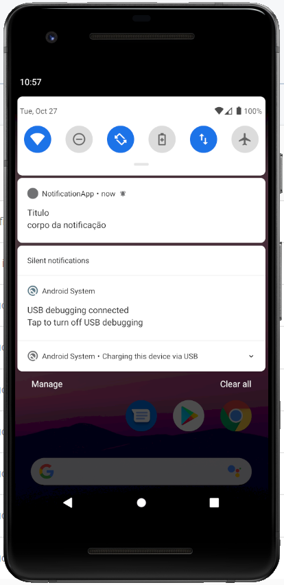

Com todos os passo anteriores concluídos podemos começar a configurar o serviço e a classe que chamaremos de **_MyFirebaseMessagingService_**. De volta ao arquivo de manifesto adicionaremos conforme o assistente nos indica no passo 4 o serviço.(Figura 8.).

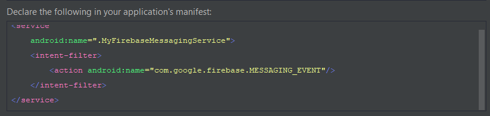

Após isso criamos a classe Kotlin com o mesmo nome e indicamos que ela é do tipo FirebaseMessagingService, logo declaramos a sobrescrita da função **_OnMessageReceive_** e **_OnNewToken_** e nela utilizando o log mostraremos quando a mensagem for recebida.

```kotlin
class MyFirebaseMessagingService : FirebaseMessagingService() {

    override fun onMessageReceived(remoteMessage: RemoteMessage) {
        super.onMessageReceived(remoteMessage)
        Log.e("Notification_APP", "Mensagem Recebida")
    }

    override fun onNewToken(remoteMessage: String) {
        super.onNewToken(remoteMessage)
        Log.e("Notification_APP", "new token recebido")
    }
```
Agora que estamos recebendo a notificação com o app em primeiro plano, vamos adaptar nossa função feita na parte um, desta vez iremos pegar os dados vindos da mensagem remota e iremos passar por parâmetro para nossa função dentro da função **_onMessageReceived_** para armazenar o título e o corpo teremos duas variáveis, chamaremos nossa nova função de **_handleShowNotification_** que receberá o contexto da aplicação e duas variáveis do tipo String que poderão ser nulas.

```kotlin
    override fun onMessageReceived(remoteMessage: RemoteMessage) {
        super.onMessageReceived(remoteMessage)
        val title = remoteMessage.notification?.title
        val body = remoteMessage.notification?.body
        handleShowNotification(applicationContext, title, body)
    }
```

```kotlin
    fun handleShowNotification(context: Context, title: String?, message: String?) {

        val titulo =
            HtmlCompat.fromHtml("<strong> ${title} </strong>", HtmlCompat.FROM_HTML_MODE_LEGACY)

        val notificationChannel: NotificationChannel
        val builder: NotificationCompat.Builder
        val channelId = "com.angeloplacebo.notificationapp"

        val notificationManager: NotificationManager =
            applicationContext.getSystemService(Context.NOTIFICATION_SERVICE) as NotificationManager

        val id = Random.nextInt(1, 100)

        val intent = Intent(this, MainActivity::class.java)
        val pendingIntent = PendingIntent.getActivity(this, 0, intent, 0)

        if (Build.VERSION.SDK_INT >= Build.VERSION_CODES.O) {
            notificationChannel =
                NotificationChannel(channelId, message, NotificationManager.IMPORTANCE_DEFAULT)
            notificationManager.createNotificationChannel(notificationChannel)

            builder = NotificationCompat.Builder(this, channelId)
                .setAutoCancel(true)
                .setSmallIcon(R.drawable.ic_launcher_foreground)
                .setContentTitle(titulo)
                .setContentText(message)
                .setPriority(NotificationCompat.PRIORITY_DEFAULT)
                .setContentIntent(pendingIntent)
        } else {
            builder = NotificationCompat.Builder(this)
                .setAutoCancel(true)  
                .setSmallIcon(R.drawable.ic_launcher_foreground)
                .setContentTitle(titulo)
                .setContentText(message)
                .setPriority(NotificationCompat.PRIORITY_DEFAULT)
                .setContentIntent(pendingIntent)
        }

        notificationManager.notify(id, builder.build())
    }
```

Assim concluímos a parte 2, exceto que desta forma quando a notificação tiver um corpo muito longo não teremos como exibir completamente, pois por padrão o corpo é truncado para que seja exibido em apenas uma linha, para resolver isso iremos inserir no nosso builder os métodos **_.setCategory_** definindo como mensagem **_.setStyle_** definido como **_bigTextStyle_** e passaremos o corpo da mensagem para nossa notificação, definindo também um novo título uma vez que ao expandir ela pode ter um novo título, e um sumário conforme o código abaixo.


```kotlin
builder = NotificationCompat.Builder(this, channelId)
                .setCategory(NotificationCompat.CATEGORY_MESSAGE)
                .setAutoCancel(true)
                .setSmallIcon(R.drawable.ic_launcher_foreground)
                .setContentTitle(titulo)
                .setStyle(
                    NotificationCompat.BigTextStyle()
                        .bigText(message)
                        .setSummaryText("Summary")
                        .setBigContentTitle(
                            HtmlCompat.fromHtml("<strong>Big Text</strong>",
                                HtmlCompat.FROM_HTML_MODE_LEGACY))
                )
                .setPriority(NotificationCompat.PRIORITY_DEFAULT)
                .setContentIntent(pendingIntent)
```
>Exibição final (Figura 9).

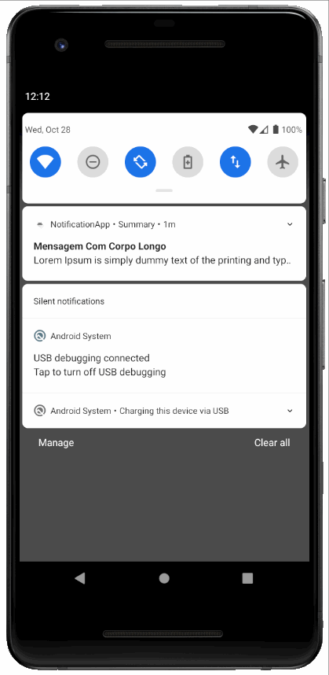

